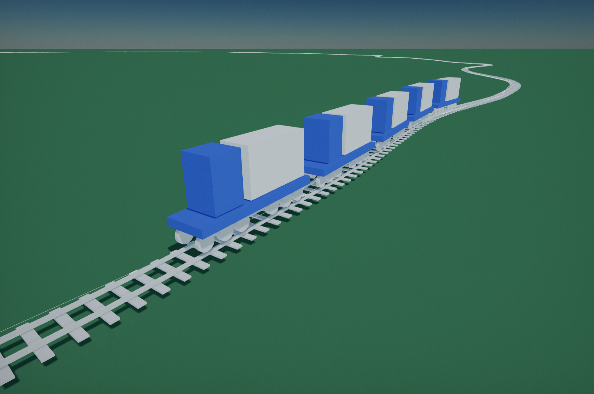

<h1>A spline tool script Project in Flax Engine</h1>

<h2>A set of simple scripts for extruding and instancing 3D meshes along a Spline. Implemented in C#.  <h2>

<h2>Spline Sampler</h2>
A base script sample some data alone the spline, used by another scripts.

<h2>Spline Extrude</h2>
Spline extrude script could generate a static model with a specific shape alone the spline. Useful to create tube or wire.

<h2>Spline Mesh</h2>
Spline mesh script could generate a static model with a specific model alone the spline. It is very helpful for creating scene with continuous arrangements, such as fences and sleeper tracks.

<h2>Train(Sample Script)</h2>
A script demonstrates how to make an actor move forward along a spline at any speed or how to get position or transform etc at any distance along spline.
